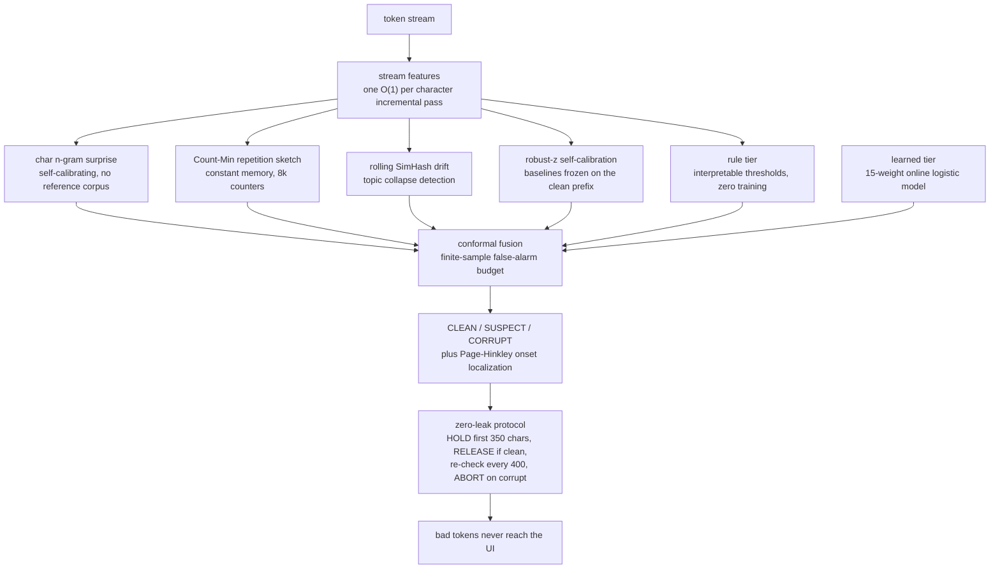
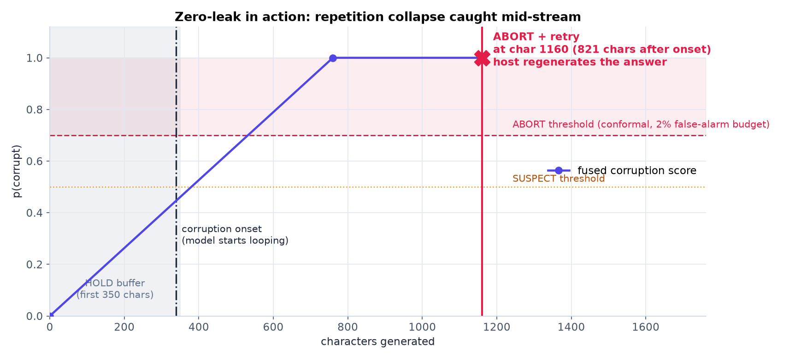
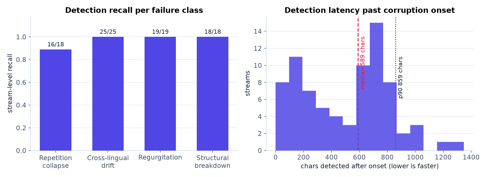
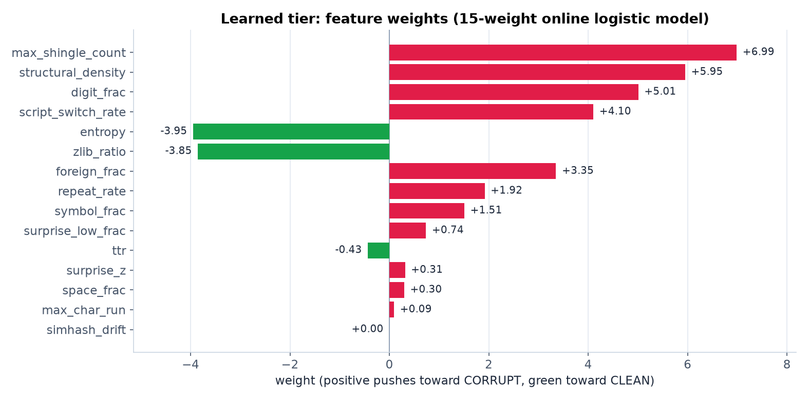

<h1 align="center">SIMURG</h1>
<p align="center"><b>Streaming Integrity Monitor &amp; Universal Regeneration Guard</b></p>
<p align="center">
Catch LLM decoding corruption <b>while the answer is still being generated</b> and cut the
stream <b>mid-flight</b>: corruption that starts in the hold window never reaches the
user, and mid-stream corruption is aborted within a few hundred characters of onset,
so the host regenerates the answer.
</p>
<p align="center">


</p>

| throughput | detection latency | false-alarm budget | footprint | setup |
|:---:|:---:|:---:|:---:|:---:|
| **197,632 chars/sec** on a laptop CPU | **~590 chars** past corruption onset | configurable, conformal-calibrated | numpy only, no model, no GPU | **3 lines**, zero training |

The guard runs hundreds of times faster than a typical LLM produces text, so it is
never the bottleneck: a model streaming at 50 tokens/sec writes ~250 chars/sec, and
SIMURG reads 197,000.

<details>
<summary><b>Table of contents</b></summary>

1. [The problem](#the-problem)
2. [How SIMURG differs](#how-simurg-differs)
3. [How it works](#how-it-works)
4. [Zero-leak in action](#zero-leak-in-action)
5. [Benchmark](#benchmark)
6. [Install](#install)
7. [Quick start](#quick-start)
8. [Teach it your domain and your failure modes](#teach-it-your-domain-and-your-failure-modes)
9. [Live guard dashboard](#live-guard-dashboard)
10. [What SIMURG is NOT](#what-simurg-is-not)
11. [Repository layout](#repository-layout)
12. [Roadmap](#roadmap)
13. [FAQ](#faq)
14. [Citation](#citation)
15. [License](#license)

</details>

---

## The problem

When you run an LLM in production, especially a **quantized, small, or self-hosted**
model, it sometimes **derails mid-generation**. The decoded stream stops doing the
task and collapses into one of a handful of pathologies:

| failure mode | what it looks like |
|---|---|
| **repetition collapse** | the same phrase, list, or token repeated until the token budget runs out |
| **cross-lingual drift** | an English answer that quietly slides into Chinese, Arabic, or Cyrillic |
| **regurgitation** | the model dumps a README, boilerplate, or training text |
| **structural breakdown** | `#REF! -0.00 -0.00 ... 0.00`: number and symbol garbage |
| **template leakage** | `<|im_start|>`, `</s>`, `[INST]`, "As an AI language model..." spilling into the answer |

This is **not** factual hallucination. A fluent-but-wrong sentence (see
[What SIMURG is NOT](#what-simurg-is-not)) has no statistical scar. What is shown
above is **decoding corruption**, and it leaves a *statistical signature in the
token stream*: repetition rate, lexical variety, script distribution,
compressibility, and predictive surprise all move in measurable ways.

SIMURG watches that signature character by character, decides in real time whether
the stream has gone bad, tells you **where** it started, and lets you **abort and
retry** before the user ever sees the corruption.

---

## How SIMURG differs

| | **SIMURG** | post-hoc linter | LLM-as-judge | perplexity threshold |
|---|---|---|---|---|
| when it fires | **mid-generation**, ~590 chars past onset | after the full answer | after the full answer | post-hoc, or needs logprob access |
| what the user sees | **zero bad tokens when onset is in the hold window**; otherwise the clean prefix plus a bad tail of at most ~900 chars, replaced by the retry | the whole corrupt answer | the whole corrupt answer | varies |
| why it fired | a named, human-readable reason on every alarm | a pattern list | the judge's opinion, if any | one number |
| model-agnostic | any OpenAI-compatible endpoint, or any stream you feed | any | any | needs a logprob-capable backend |
| overhead | numpy-only, ~197k chars/sec on one CPU core | trivial | one extra LLM call per answer | per-token logprobs |

The zero-leak property is the point: post-hoc checks can only tell you that the
answer was bad *after the user read it*. SIMURG holds the opening of every stream
in a buffer, releases it only once it is verified clean, keeps re-checking, and
cuts the stream the moment it crosses the calibrated threshold.

---

## How it works

SIMURG makes **one O(1)-per-character pass** over the stream, maintaining a set of
incremental features (digit fraction, foreign-script fraction, repetition rate,
compressibility, type-token ratio, script-switch rate, structural-artifact density,
...), and feeds a pluggable detector ensemble on top of them:



### The five detectors

| detector | what it measures | why it catches corruption |
|---|---|---|
| **char n-gram surprise** | predictive surprise of each char against an in-stream 3-gram model | loops and garbage drive surprise toward zero |
| **Count-Min repetition** | n-gram repetition rate in a constant-memory sketch | repetition collapse is the most common production failure |
| **rolling SimHash drift** | distance of a 48-token fingerprint from the clean-prefix baseline | topic collapse and regurgitation move the fingerprint |
| **robust-z self-calibration** | every feature z-scored against its own frozen clean-prefix baseline | no hand-tuned magic numbers, adapts to any domain |
| **rules** | interpretable thresholds (digit fraction, script switch, template markers, ...) | day-one coverage, every alarm is a sentence a human can read |

### Two tiers cooperate

- **Rule tier.** Interpretable thresholds on the stream features. Works on day one
  with **zero training**, and every alarm is explainable: `"repetition loop
  rate=0.71"`, `"digit fraction 0.57"`, `"script switch en to zh"`.
- **Learned tier.** A small **online logistic regression** (15 weights, a few KB)
  that adds robustness and **keeps learning in production** via `partial_fit`.

### Conformal calibration: a budget, not a hope

The fusion layer sets its thresholds from the score distribution on *clean*
streams, which gives a **finite-sample guarantee on the false-alarm rate**. "Flag
at most 2% of clean outputs" is a knob you set and the calibration enforces, not a
threshold you hope holds.

### The zero-leak protocol

1. **HOLD** the first 350 characters. A stream that is corrupt from the start is
   killed before a single character reaches the UI.
2. **RELEASE** the prefix if it scores clean, and freeze the self-calibrated
   baselines on it.
3. **Re-check** every 400 characters for the rest of the stream.
4. **ABORT** on a calibrated threshold crossing (with a 2-hit or hard-rule
   hysteresis so a single noisy checkpoint does not kill a good answer).

---

## Zero-leak in action

A synthetic stream that is clean prose and then collapses into a repetition loop
at character 339. SIMURG holds the opening, verifies the clean prefix, scores
the stream at every 400-char checkpoint, and aborts 821 characters after the
loop starts. Corrupt streams that are already bad at the 350-char checkpoint
are blocked fully (12 of 21 in the benchmark, see below); for this mid-stream
onset the user sees the clean prefix plus a short bad tail, and the guard's
contract with the host is a **retry**: `GuardedLLM` regenerates the answer and
the host replaces the shown text, so the bad tail never becomes the final
output:



Every alarm carries the reasons that fired it. For the stream above:

```
repetition loop rate=0.66 zlib=0.10
vocabulary collapse ttr=0.09
surprise collapse low_frac=1.00
```

---

## Benchmark

Reproducible end-to-end benchmark: builds the **CorruptBench** synthetic set
(243 streams, 4 failure classes), trains the learned tier, calibrates the
conformal thresholds, and reports the full table:

```bash
pip install -e .
python3 -m simurg.data.evaluate          # seed 7, deterministic dataset
```

Test split (81 streams), seed 7:

| metric | value |
|---|---|
| stream-level TPR | **78/80 = 0.975** |
| recall, repetition collapse | 16/18 = 0.89 |
| recall, cross-lingual drift | 25/25 = 1.00 |
| recall, regurgitation | 19/19 = 1.00 |
| recall, structural breakdown | 18/18 = 1.00 |
| detection latency past onset | **median 590**, p90 868 chars |
| onset localization error | median 532 chars |
| zero-leak (onset inside hold window) | 12/21 blocked fully |
| throughput | **197,632 chars/sec** |
| stream-level AUROC (final score) | 0.55, dragged down by ties at p=1.0 and a 1-stream clean test split; TPR/FPR at the calibrated threshold is the operating metric |

In addition, the shipped detector **flagged 0 false alarms on 121 real production
texts** from a self-hosted reasoning-model deployment.





**Those numbers describe the bundled domain.** The detector is only as good as the
clean corpus it calibrates against, so retrain on your own traffic before you
trust it in production. It takes seconds, see
[below](#teach-it-your-domain-and-your-failure-modes).

---

## Install

```bash
pip install simurg        # numpy only
pip install simurg[figures]   # + matplotlib, for the paper plots
pip install simurg[test]      # + pytest
```

From source:

```bash
git clone https://github.com/doofzoff/SIMURG.git
cd SIMURG
pip install -e .
```

---

## Quick start

### 1. Guard any OpenAI-compatible endpoint (3 lines)

Works with **vLLM, llama.cpp server, TGI, Ollama, OpenAI, OpenRouter**: anything
that speaks `/v1/chat/completions`. Batteries included: the zero-leak protocol
plus an **abort, retry, fallback-model** ladder.

```python
from simurg import GuardedLLM

llm = GuardedLLM(
    "http://localhost:8000/v1", model="my-model",
    retries=1,
    fallback=GuardedLLM("https://openrouter.ai/api/v1",
                        model="qwen/qwen3", api_key="sk-..."),   # optional
)

result = llm.chat(
    [{"role": "user", "content": "Explain how oil prices affect a small economy."}],
    on_token=lambda t: print(t, end="", flush=True),             # only CLEAN text is ever forwarded
)

print(result.ok)        # True if a clean answer was produced
print(result.verdict)   # "clean" | "suspect" | "corrupt"
print(result.attempts)  # the full ladder: what each attempt did and why
```

If an attempt corrupts, **nothing from it reaches `on_token`**. A corrupt attempt
is retried; if all retries fail, the fallback model is tried.

### 2. Guard a stream from any source (5 lines)

Not on an OpenAI-style API? Wrap your own token loop:

```python
from simurg import Simurg

s = Simurg()                          # rule tier works with zero setup
for token in my_llm_stream():
    v = s.feed(token)
    if v.state == "corrupt":
        abort_and_retry(reason=v.reasons, onset=v.onset_char)
        break
    ui.write(v.released)              # text cleared for display (may lag while holding)
final = s.finish()
ui.write(final.released)
```

### 3. Post-hoc check of a finished text

```python
from simurg import Simurg

s = Simurg()
s.feed(whole_text)
print(s.finish().state)               # "clean" / "suspect" / "corrupt"
```

---

## Teach it your domain and your failure modes

### Retrain on your traffic

Feed the calibration step **your** good outputs so the thresholds fit your domain:

```bash
# bring your own clean corpus (.jsonl with a "text" field per line)
SIMURG_CORPUS_JSONL=/path/to/my_clean_outputs.jsonl python3 -m simurg.data.evaluate --save
```

Full guide, including the quick path, the live dashboard, and the production
flywheel: **[docs/TRAINING.md](docs/TRAINING.md)**.

### Teach it a NEW failure mode from examples, with an honesty gate

Give SIMURG examples of *your* model's bad outputs. It tells you **whether that
failure is even catchable** in stream statistics, and hands you a fitted detector
if it is:

```python
from simurg import fit_custom_detector

report, detector = fit_custom_detector(
    "template_leak",
    clean_texts   = my_good_outputs,     # 50+
    corrupt_texts = my_bad_outputs,      # 20+
)
print(report)
#  verdict: DETECTABLE   held-out AUROC: 0.98   -> auto-registered into every Simurg()
```

The gate is the point: fluent factual lies come back **`NOT DETECTABLE`** instead
of a false promise. Details, plus the zero-training `LexiconDetector` for known
bad markers like `<|im_start|>`: **[docs/CUSTOM.md](docs/CUSTOM.md)**.

### Watch it train, live

```bash
python3 -m simurg.training.train_live      # writes metrics for the bundled dashboard
```

A real-time web dashboard: log-loss, accuracy, AUROC, **all 15 weights animating
per epoch**, memory, and the final held-out TPR/FPR verdict.

---

## Live guard dashboard

A second web page for *runtime*: connect it to any OpenAI-compatible endpoint,
send a prompt, and watch the answer get guarded while it is generated. The
dashboard renders in real time:

- the **released stream text** (what the user would actually see),
- the **fused corruption score** with the calibrated SUSPECT/ABORT thresholds
  and the 350-char hold zone,
- the **corruption onset marker** and the human-readable **reasons**,
- **all 15 stream features** as sparklines, sampled at every checkpoint.

Every run is recorded as a **session** (timestamped frames with score, state,
released text, features and reasons). The sessions panel lists them, deletes
them, and **replays any session at up to 128x** for postmortem analysis, so a
corrupt answer from Tuesday can be re-watched the way a crash log is read.

```bash
python3 -m simurg.guard_dashboard --port 8321
# open http://127.0.0.1:8321, point it at your endpoint, guard a stream
```

Pasted texts can also be analyzed at full speed in the same UI. Same
self-contained dark style as the training dashboard, zero new dependencies:
the server is stdlib-only and acts as a CORS-free proxy to your endpoint.

---

## What SIMURG is NOT

SIMURG detects **corrupt or degenerate decoding**, not **factual wrongness**. A
fluent, well-formed sentence that is simply *false* ("the capital of Australia is
Sydney") has no stream-statistical signature: it looks exactly like a true
sentence. For that you need **grounding** (constrain the model to retrieved facts
and make it quote them), retrieval verification, or a factuality checker.

SIMURG guards the *delivery*; grounding guards the *content*. Use both.
`fit_custom_detector` will explicitly refuse to pretend it can catch this class.

---

## Repository layout

```
src/simurg/
├── core.py              taxonomy, detector protocol, registry
├── features.py          the single O(1)/char stream-feature pass
├── signals/             the raw estimators: n-gram surprise, Count-Min sketch,
│                        rolling SimHash, robust-z calibration, Page-Hinkley
├── detection/           rules, detectors, conformal fusion, sentinel (protocol)
├── learning/            online logistic model, custom-failure-mode training (BYOC)
├── integrations/        GuardedLLM, the OpenAI-compatible drop-in guard
├── data/                CorruptBench synth, dataset builder, benchmark, generator
├── training/            live-training run + real-time web dashboard
├── guard_dashboard.py   live guard dashboard server (stdlib-only, SSE, sessions)
├── guard_ui/            live guard dashboard front-end + recorded sessions
└── weights/             shipped model + conformal thresholds (use as a pair)
docs/                    TRAINING.md, CUSTOM.md
examples/                runnable quickstart
tests/                   sentinel regressions + end-to-end dashboard tests
figures/                 benchmark figures referenced by this README
```

---

## Roadmap

Ideas under active consideration, in rough priority order:

1. **Engine-level abort.** Ship integrations that stop generation *inside* the
   inference engine (a vLLM streaming hook and a generic SSE middleware proxy),
   so an abort frees GPU time instead of just saving the UI. The guard already
   exposes everything a host needs; what is missing is the wiring.
2. **Fleet telemetry.** Export `p(corrupt)`, verdict transitions, and onset
   positions as Prometheus metrics or OpenTelemetry spans, so a Grafana panel can
   show a *corruption rate per model and endpoint* and alert when a quantization
   or a prompt change starts producing bad streams.
3. **Zero-dependency runtime.** Export the guard core (features, sketches,
   fusion) to ONNX or a small C library that runs inside the inference server
   with no Python, for hosts that cannot take a numpy dependency on the hot path.
4. **CI regression suite.** A golden corpus of labeled clean and corrupt streams
   with fixed expected verdicts, plus latency and throughput budgets, run as a
   GitHub Action on every pull request: the build fails when a threshold tweak
   quietly degrades detection.
5. **Multi-stream fleet mode.** Guard N parallel live streams in one process,
   with per-stream sessions and a single dashboard that compares corruption
   rates across endpoints, so a bad quantization shows up as one lane going red
   while the others stay green.

---

## FAQ

**Will it catch factual hallucinations?**
No, and it will tell you so. Factual errors have no stream-statistical signature.
Use grounding or a factuality checker for content, SIMURG for delivery.

**What is the overhead?**
One O(1) pass per character, ~197k chars/sec on a laptop CPU. A 50 tok/s model
writes ~250 chars/sec, so the guard is hundreds of times faster than the model it
guards. Memory is bounded per stream: 8,192 sketch counters, a 48-token SimHash
window, and an n-gram table capped at 60k contexts.

**Does it only work with English?**
No. Script features are language-agnostic (per-script fractions, switch rates),
and you can declare your expected scripts at construction time
(`Simurg(expected_scripts=("cyrillic",))`). Retrain on your traffic for best
results.

**What is the SUSPECT state for?**
It is a non-blocking warning tier between CLEAN and CORRUPT. Your host can use it
to slow the UI down, show a subtle indicator, or pre-stage a retry, without
discarding a stream that may still turn out clean.

**How do I retrain on my own domain?**
`SIMURG_CORPUS_JSONL=... python3 -m simurg.data.evaluate --save` over your clean
outputs. It rebuilds the weights and the conformal thresholds in seconds. Full
guide: [docs/TRAINING.md](docs/TRAINING.md).

---

## Citation

```bibtex
@techreport{aghayev2026simurg,
  title       = {SIMURG: Zero-Leak Online Detection of LLM Decoding Corruption in Production Streams},
  author      = {Aghayev, Farid},
  institution = {HAL-X AI},
  year        = {2026},
  url         = {https://github.com/doofzoff/SIMURG}
}
```

## License

**Apache-2.0**. See [LICENSE](LICENSE). Developed by **doofZ (Farid Aghayev)**,
HAL-X AI.
